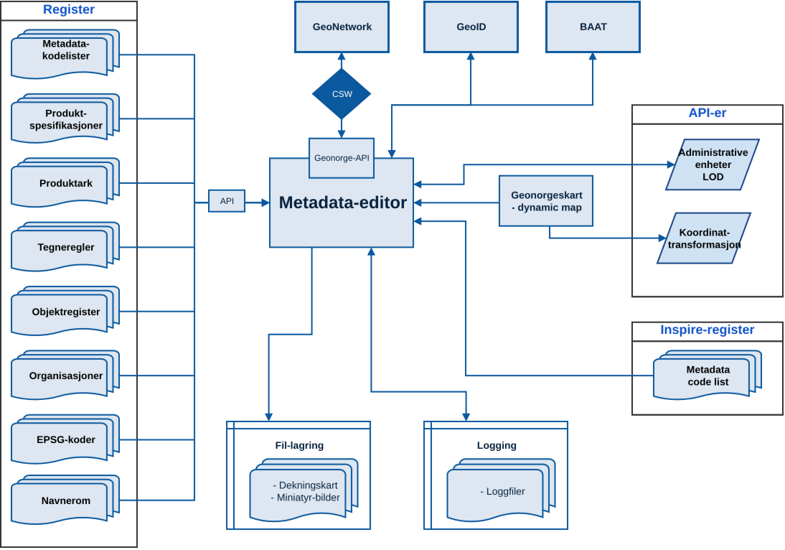
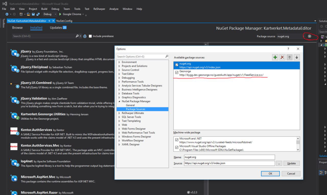

# Metadataeditor
Denne docspagen ble kopiert fra Confluence 16.06.2026. Confluence-siden var da sist redigert i 2023.

## Diagram

## Beskrivelse

Tilbyr brukeren enkel administrasjon av metadata som er registrert i GeoNetwork.

## Kjøremiljø

- Dev: <http://editor.dev.geonorge.no/>
- Test: <https://editor.test.geonorge.no/>
- Prod: <https://editor.geonorge.no/>

## Teknisk

Kildekode: https://github.com/kartverket/MetadataEditor

Applikasjonen er utviklet med C# og .NET Framework. Applikasjonen er et webbasert overbygg på GeonorgeAPI-biblioteket. Alle endringer på metadataene gjøres ved hjelp av dette biblioteket.

## Utviklingsmiljø

### Konfigurasjon

Fil: `settings.config`  
Kopier `settings.default.config` til `settings.config` og gjør endringer etter behov.  
> [!WARNING]
> `settings.config` skal aldri sjekkes inn i git, og det skal aldri legges brukernavn og passord i `settings.default.config`.  

Legg inn `GeoNetworkUsername`/`GeoNetworkPassword` og `WebserviceGeonorgeUsername`/`WebserviceGeonorgePassword` ved å hente verdier fra KeePass.

## NuGet package source

Editoren benytter NuGet-pakken `Kartverket.Geonorge.Utilities`. Denne må hentes ned direkte fra byggeserveren (TeamCity).

Legg til en NuGet package source i Visual Studio:

`http://bygg.dev.geonorge.no/guestAuth/app/nuget/v1/FeedService.svc/`

